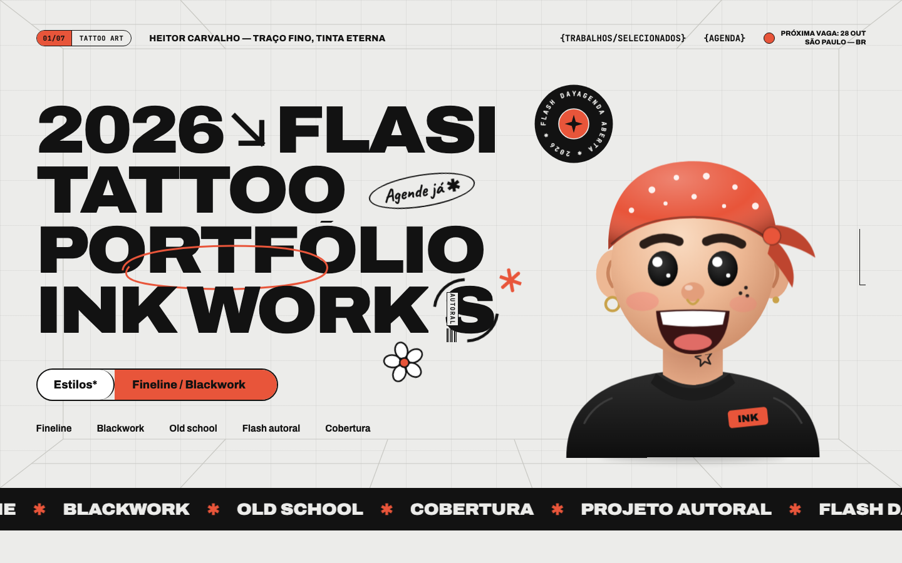
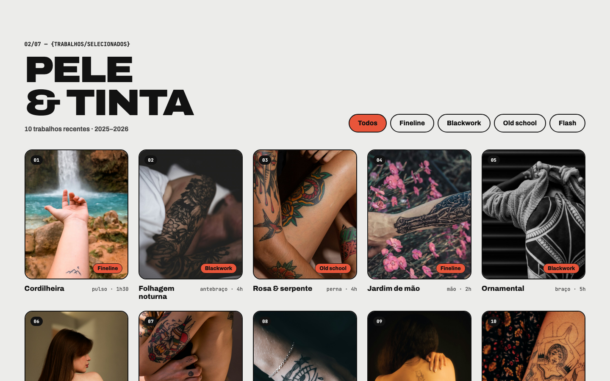
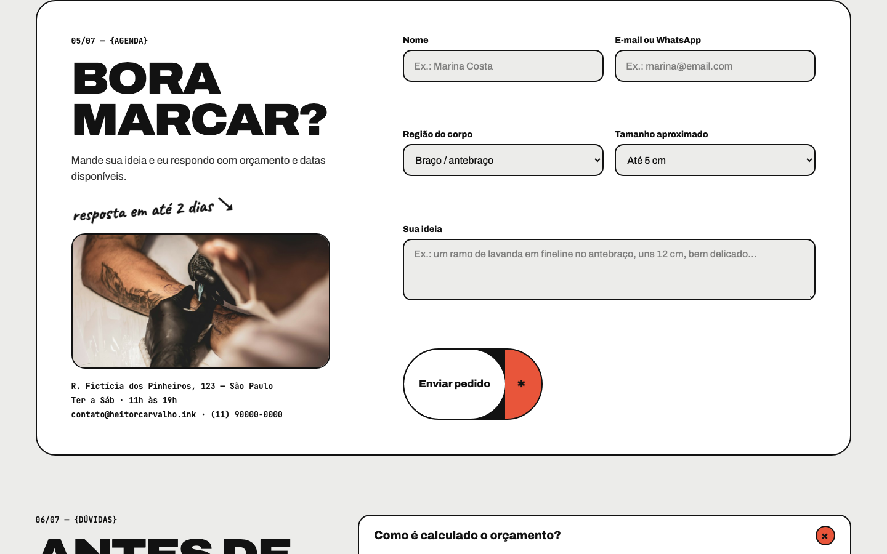
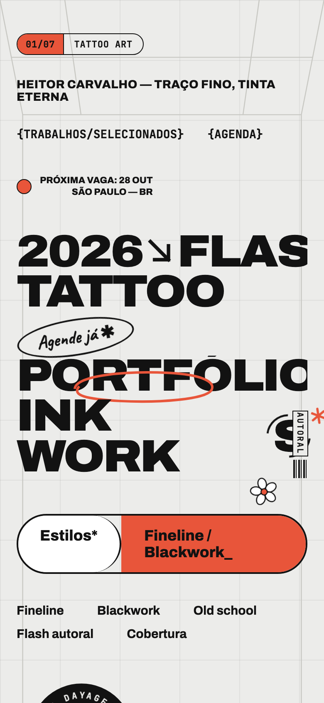

# Ink Tattoo

> Projeto criado para complementar o meu portfólio pessoal: **[portifolio-heitor.vercel.app](https://portifolio-heitor.vercel.app/)**
>
> O estúdio é fictício — endereço, telefone e e-mail são só para demonstração.

Site-portfólio de um tatuador em Pinheiros, São Paulo, focado em fineline, blackwork, old school e flash autoral.
A ideia é mostrar os trabalhos, vender os flashes disponíveis e facilitar o agendamento.

## O que tem no site

- **Trabalhos selecionados** — galeria com filtro por estilo (fineline, blackwork, old school, flash).
- **Flash autoral** — desenhos prontos com preço, marcando os que já foram reservados.
- **Sobre o artista** — apresentação do tatuador e do estúdio.
- **Agenda** — formulário com região do corpo, tamanho e ideia, que monta a mensagem e abre o WhatsApp do estúdio.
- **FAQ** — dúvidas comuns sobre orçamento, cuidados e sessão.

  

## Tecnologias

React 19, TypeScript, Tailwind CSS v4 e Vite.

## Acesse o site

**[ink-tattoo-one.vercel.app](https://ink-tattoo-one.vercel.app/)**
